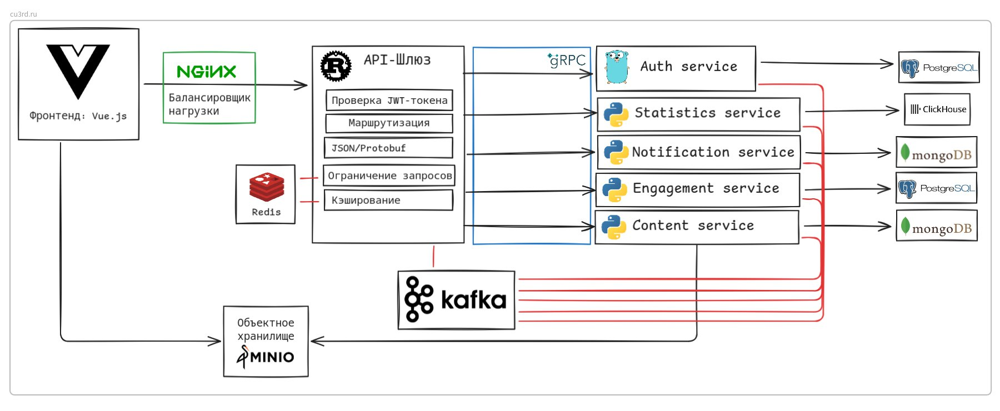

# Library

## Structure

- `backend` - Rust monolith service (Axum) providing auth, content, engagement, and statistics APIs.
- `proto` - Legacy gRPC service definitions (kept for reference).
- `frontend` - Vue.js frontend app.

The backend uses in-memory stores for user/accounts, engagement, and statistics, plus file-backed
content storage. It is designed for local development and prototyping.
